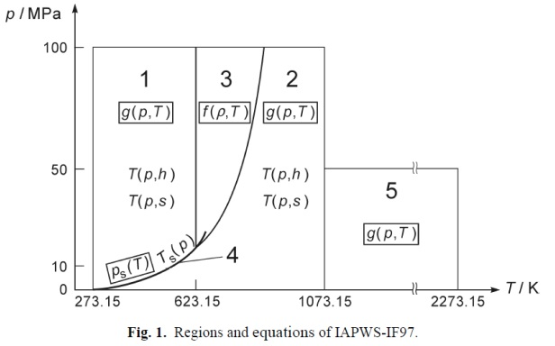

# IF97 Lua

Lua библиотека для расчета термодинамических свойств воды и пара по стандарту IAPWS IF97.

## Особенности

- **Научная точность** - Полное соответствие стандарту IAPWS IF97
- **Простой API** - Интуитивно понятный интерфейс
- **Мультирегионная поддержка** - Поддержка регионов воды и пара (регионы 3-4 в разработке)

## Соотношение регионов IAPWS-IF97

Согласно модели IAPWS-IF97, свойства воды и пара рассчитываются по разным уравнениям в зависимости от фазового состояния:

| № | Обозначение |  Описание (RU) |
|---|-------------|----------------|
| 1 | **Water**   | Вода |
| 2 | **Steam**   | Перегретый пар |
| 3 | **Fluid**   | Сверхкритическая жидкость/флюид |
| 4 | **Mix**     | Пароводяная смесь |
